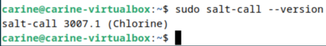
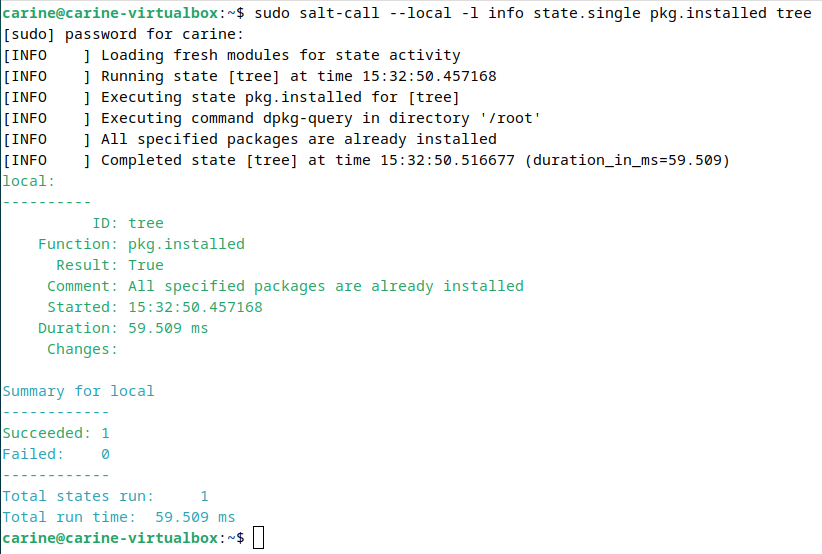
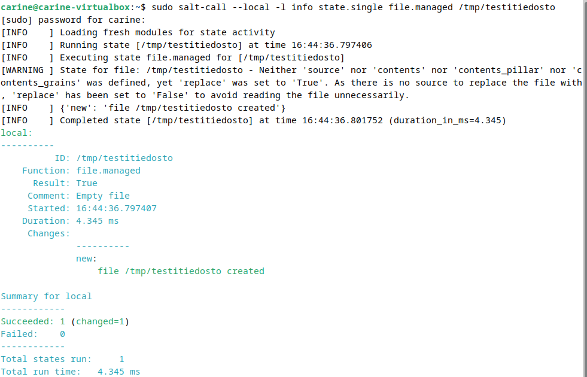
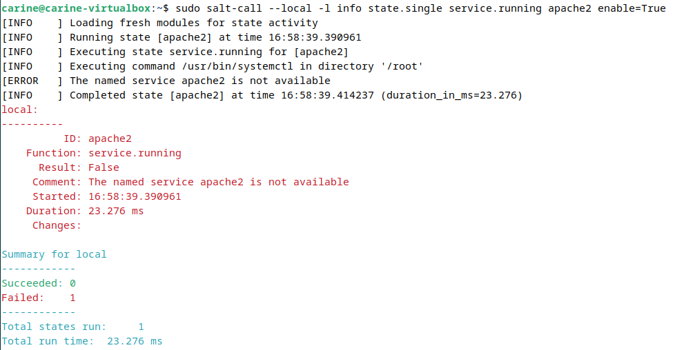
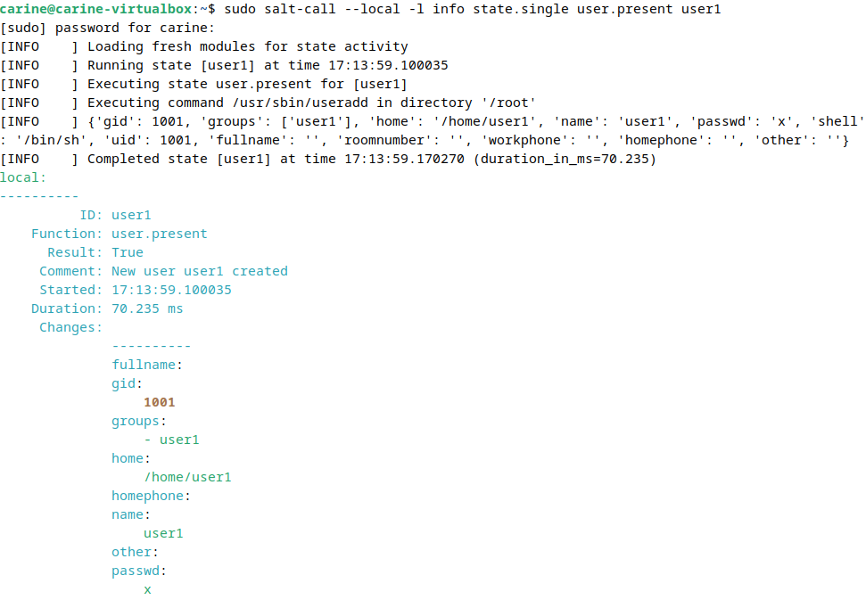
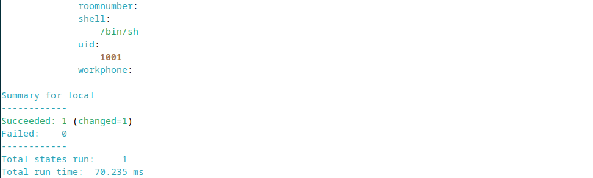
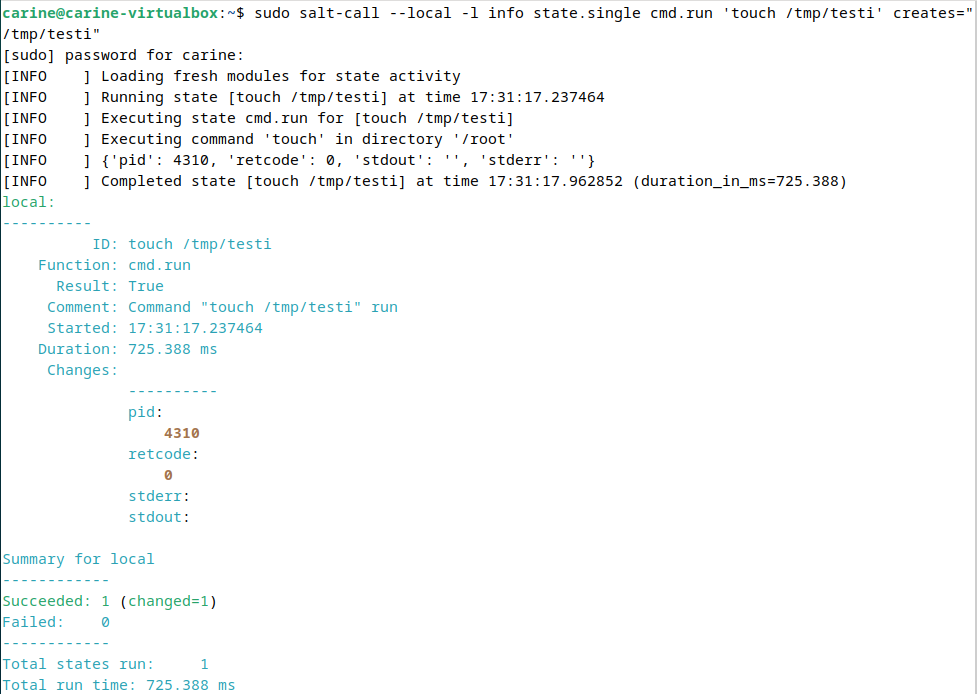
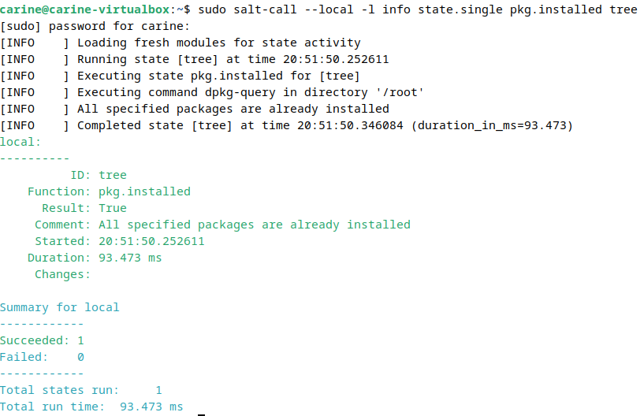

# h1 Viisikko

Viikon 1 tehtävät:

## x) Lue ja tiivistä (Tässä x-alakohdassa ei tarvitse tehdä testejä tietokoneella, vain lukeminen tai kuunteleminen ja tiivistelmä riittää. Tiivistämiseen riittää muutama ranskalainen viiva. Ei siis vaadita pitkää eikä essee-muotoista tiivistelmää. Lisää kuhunkin jokin oma kysymys tai huomio.).

## Run Salt Command Locally
- Saltia käytetään yleensä ohjaamaan useita koneita verkon yli
- Salt-komentoja voi ajaa paikallisesti ja nähdä tuloksen heti
- hyödyllistä harjoitteluun, testaukseen ja nopeaan käyttöönottoon
- samat Salt-komennot toimivat Linuxissa ja Windowsissa
- tärkeimmät: pkg, file, service, user ja cmd
  
## Salt Quickstart - Salt Stack Master and Slave on Ubuntu Linux
- Saltilla voidaan hallita useita koneita
- Slave = ohjattavat koneet. Voi olla missä tahansa, esim. palomuurin takana, silti niitä voi ohjata
- Master = ohjaava kone. Ainoa, jonka pitää olla saavutettavissa verkosta julkisella osoitteella
- Asenna master. Jos masterilla palomuuri, pitää sallia liikenne porteissa 4505/tcp ja 4506/tcp
- Asenna slave. Slaven pitää tietää, missä master sijaitsee. Slavelle voi antaa oman nimen (id)
- Käynnistä slaven minion-palvelu uudelleen, että se ottaa uudet asetukset käyttöön ja yhdistää masteriin
- Hyväksy slaven avain masterissa
- Testaa yhteys. Jos saat vastauksen slaveilta, on ensimmäinen slave käytössäsi
- Komentojen mukana saattaa tulla turhia varoituksia, ne voi vaan ohittaa
- Kun master-slave yhteys saatu toimimaan, voit opetella state-tiedostojen kirjoittamista 
- State-tiedosto = määrittää, millaisessa tilassa slaven pitää olla, esim. mitä ohjelmia asennettu, mitä asetuksia käytössä
  
## Raportin kirjoittaminen
- Raportoinnilla tarkoitetaan, että kerrotaan tarkasti mitä on tehnyt ja mitä on tapahtunut
- Kirjoita koko ajan samalla, kun teet tehtävää
- Raportin pitää tuottaa sama tulos samassa ympäristössä kaikilla, mukaan lukien harhapolut. Raportoi myös testiympäristö selkeästi
- Kirjaa täsmällisesti, mitä komentoja on annettu ja mitä on tehty
- Merkitse kellonajat, jotta voit seurata työvaiheiden kestoa ja mahdolliset laajemmat viat
- Jos ilmenee virheitä, kuvaile ne selkeästi ja raportoi tarvittaessa
- Käytä mennyttä aikamuotoa: esim. "valitsin", "irroitin"
- Kirjoita helppolukuisesti ja huolellista kieltä. Käytä väliotsikoita tarvittaessa
- Aina viittaus lähteisiin
- Valehtelu (esim. raportoitu, että muka tehty jotain, mitä ei oikeasti ole tehty), tekstin plagiointi ja kuvien laiton kopiointi kiellettyä
  
## WMWare Inc. Salt Install Guide: Linux (DEB)
- Ohjeet kertovat, miten Salt asennetaan käyttöjärjestelmiin, jotka ovat Debianin kaltaisia:
  1. Asenna Salt Projectin repository
  2. Suorita sudo apt update 
  3. Asenna salt-minion, salt-master ja muut Saltin osat
  4. Ota Salt-services käyttöön ja käynnistä
 
## a) Asenna Debian 12-Bookworm virtuaalikoneeseen (Poikkeuksellisesti tätä alakohtaa ei tarvitse raportoida, jos siinä ei ole mitään ongelmia).

Asensin Debian 12-Bookwormin virtuaalikoneelleni. Asennus onnistui ilman ongelmia.
## b) Asenna Salt (salt-minion) Linuxille (uuteen virtuaalikoneeseesi)
Saltin asennus virtuaalikoneelle:

Ennen Saltin asennusta:

`mkdir -p /etc/apt/keyrings` = varmistin, että keyrings-kansio on olemassa

`curl -fsSL https://packages.broadcom.com/artifactory/api/security/keypair/SaltProjectKey/public | sudo tee /etc/apt/keyrings/salt-archive-keyring.pgp` = latasin julkisen avaimen

`curl -fsSL https://github.com/saltstack/salt-install-guide/releases/latest/download/salt.sources | sudo tee /etc/apt/sources.list.d/salt.sources` = loin apt repo määritystiedoston

Tämän jälkeen Saltin virallinen asennus:

`sudo apt-get update` = hain päivitykset

`sudo-apt get -y install salt-minion` = asensin saltin

`sudo salt-call --version`= tarkistin vielä, että Salt varmasti asentunut. Sain onnistuneen vastauksen

## c) Viisi tärkeintä. Näytä Linuxissa esimerkit viidestä tärkeimmästä Saltin tilafunktiosta: pkg, file, service, user, cmd. Analysoi ja selitä tulokset.

## pkg

Pkgn avulla hallinnoidaan ohjelmien asennusta.

`sudo salt-call --local -l info state.single pkg.installed tree` = asensin treen

ID = tree (paketti mitä Salt käsitteli)

Function = pkg.installed (mitä funktiota käytetty)

Result = True (onnistunut suoritus)

Comment = All specified packages are already installed (tree oli jo valmiiksi asennettu, vaikka itse en ole sitä asentanut)

Started = 15.32 (milloin alkanut)

Duration = 59.509 ms (kesto)

Changes = ei muutoksia, koska tree löytyi jo (mitä muutoksia on tehty)

Total states run = 1 (montako tehtävää suoritettu)

Total run time = 59.509 ms (kokonaiskesto)

## file

Filen avulla hallinnoidaan tiedostoja.

`sudo salt-call --local -l info state.single file.managed /tmp/testitiedosto` = loin testitiedoston

ID = /tmp/testitiedosto (tiedostopolku, mitä Salt käsitteli)

Function = file.managed (mitä funktiota käytetty)

Result =  True (onnistunut suoritus)

Comment = Empty file (tyhjä tiedosto)

Started = 16.44 (milloin suoritus alkanut)

Duration = 4.345 ms (kesto)

Changes = new: file /tmp/testitiedosto created (muutokset)

Total states run = 1 (montako tehtävää suoritettu)

Total run time = 4.345 ms (kokonaiskesto)

## service

Servicen avulla hallitaan palveluita ja sitä, ovatko ne käynnissä vai eivät.

`sudo salt-call --local -l info state.single service.running apache2 enable=True` = yritin käynnistää apachea

ID = apache2 (palvelu, minkä tilaa Salt yritti muuttaa)

Function = service.running (mitä funktiota käytetty)

Result = False (funktion ajaminen ei onnistunut, koska apachea ei ole asennettu)

Comment = The named service apache2 is not available (koska apachea ei ole asennettu)

Started = 16.58 (milloin suoritus alkanut)

Duration = 23.276 ms (milloin suoritus alkanut)

Changes = ei muutoksia

Total states run = 1 (montako tehtävää suoritettu)

Total run time = 23.276 m (kokonaiskesto)

## user 

Userin avulla hallitaan käyttäjiä ja niiden asetuksia.

`sudo salt-call --local -l info state.single user.present user1` = loin uuden käyttäjän nimeltä user1

ID = user1 (käyttäjä, jonka Salt loi)

Function = user.present (mitä funktiota käytetty)

Result = True (onnistunut suoritus)

Comment = New user user1 created (uusi käyttäjä luotu)

Started = 17.13 (milloin suoritus alkanut)

Duration = 70.235 ms (kesto)

Changes = 
  groups = user1
  
  home = /home/user1/
  
  name = user1
  
  shell = /bin/sh
  
  uid = 1001

Total states run = 1 (montako tehtävää suoritettu)

Total run time = 70.235 ms (kokonaiskesto)

## cmd

Cmdn avulla hallitaan komentojen suorittamista. Voidaan määrittää, että komento suoritetaan vain tietyjen ehtojen täytyttyä.

`sudo salt-call --local info state.single cmd.run 'touch /tmp/testi' creates="/tmp/testi"` = loin testi-tiedoston

ID = touch /tmp/testi (komento, jonka Salt suoritti luodakseen tiedoston)

Function = cmd.run (mitä funktiota käytetty)

Result = True (onnistunut suoritus)

Comment = Command "touch /tmp/testi" run (komento suoritettu)

Started = 17.31 (milloin suoritus alkanut)

Duration = 725.399 ms (kesto)

Changes = 
  pid = 4310
  retcode = 0

Total states run = 1 (montako tehtävää suoritettu)

Total run time = 725.399 ms (kokonaiskesto)

## d) Idempotentti. Anna esimerkki idempotenssista. Aja 'salt-call --local' komentoja, analysoi tulokset, selitä miten idempotenssi ilmenee.

Idempotentti = Toiminto, jonka voi suoritta useita kertoja, mutta lopputulos pysyy jokaisen suorituskerran jälkeen samana. Esimerkiksi jos tree-pakettia ei ole asennettu, Salt asentaa sen. Jos se on jo asennettu, Salt ei tee mitään. Komennon voi ajaa niin monta kertaa kuin haluaa, mutta lopputulos pysyy samana.

Kun asensin treetä komennolla `sudo salt-call --local -l info state.single pkg.installed tree`, sain vastaukseksi, että se on jo asennettu. Kokeilin komentoa pari kertaa uudelleen ja sain aina saman vastauksen, että se löytyy jo.

Ensimmäinen kerta:

Seuraavat kerrat:

Lopputulos pysyi siis koko ajan samana.

## Lähteet:

Karvinen, T. 2025. Palvelinten hallinta: Läksyt. Luettavissa: https://terokarvinen.com/palvelinten-hallinta/#laksyt Luettu: 27.3.2025

Karvinen, T. 2023. Run Salt Command Locally. Luettavissa: https://terokarvinen.com/2021/salt-run-command-locally/ Luettu: 27.3.2025

Karvinen, T. 2018. Salt Quickstart - Salt Stack Master and Slave on Ubuntu Linux. Luettavissa: https://terokarvinen.com/2018/03/28/salt-quickstart-salt-stack-master-and-slave-on-ubuntu-linux/ Luettu: 27.3.2025

Karvinen, T. 2006. Raportin kirjoittaminen. Luettavissa: https://terokarvinen.com/2006/06/04/raportin-kirjoittaminen-4/ Luettu: 27.3.2025

WMWare Inc. Salt Install Guide: Linux (DEB). Luettavissa: https://docs.saltproject.io/salt/install-guide/en/latest/topics/install-by-operating-system/linux-deb.html Luettu: 27.3.2025

Karvinen, T. 2024. Install Debian on Virtualbox. Luettavissa: https://terokarvinen.com/2021/install-debian-on-virtualbox/ Luettu: 27.3.2025

WMWare Inc. 2025. Salt.States.Pkg. Luettavissa: https://docs.saltproject.io/en/master/ref/states/all/salt.states.pkg.html Luettu: 28.3.2025

WMWare Inc. 2025. Salt.States.File. Luettavissa: https://docs.saltproject.io/en/3006/ref/states/all/salt.states.file.html Luettu: 28.3.2025

WMWare Inc. 2025. Salt.States.Service. Luettavissa: https://docs.saltproject.io/en/3006/ref/states/all/salt.states.service.html Luettu: 28.3.2025

WMWare Inc. 2025. Salt.States.User. Luettavissa: https://docs.saltproject.io/en/3006/ref/states/all/salt.states.user.html Luettu: 28.3.2025

WMWare Inc. 2025. Salt.States.Cmd. Luettavissa: https://docs.saltproject.io/en/3006/ref/states/all/salt.states.cmd.html Luettu: 28.3.2025

WMWare Inc. 2025. Glossary. Luettavissa: https://docs.saltproject.io/en/3006/glossary.html Luettu: 28.3.2025

