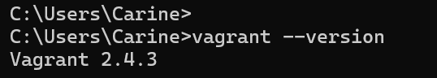

# h2 Soitto kotiin

Viikon 2 tehtävät:

## x) Lue ja tiivistä.

## Two Machine Virtual Network With Debian 11 Bullseye and Vagrant

- Vagrantin avulla kahden koneen virtuaaliverkko pystyyn nopeasti
- Asenna Vagrant
- Luo uusi hakemisto projektille ja tallenna Vagrantfile sinne. Vagrantfile sisältää 
- SSH-yhteys virtuaalikoneisiin
- Molemmat koneet voivat kommunikoida keskenään ja käyttää Internetiä
- Virtuaalikoneet voi tuhota nopeasti
- Hyvä tapa harjoitella: tee, testaa, tuhoa ja aloita alusta
- Jos kaikki toimii, olet valmis. Jos ei, jatka vianmääritykseen

## Salt Quickstart – Salt Stack Master and Slave on Ubuntu Linux

- Saltilla voi kontrolloida lukuisia koneita
- Slavet voivat sijaita missä vain ja silti niitä voi kontrolloida
- Vain masterin on oltava julkinen osoite
- Verkossa voi olla yksi master ja useita slaveja
- Asenna master. Jos masterilla on palomuuri, on porttien 4505/TCP ja 4506/TCP oltava auki
- Asenna slave. Slaven pitää tietää missä master sijaitsee
- Käynnistä uudelleen slave daemon saadaksesi uudet asetukset käyttöön ja yhdistääksesi slave masteriin
- Hyväksy slave key masterilla
- Testaa, jos sait vastaksen slavelta, olet onnistunut tehtävässä
- Nyt voit kokeilla muita komentoja slaveillesi

## Salt Vagrant - automatically provision one master and two slaves

-

## a) Hello Vagrant! Osoita jollain komennolla, että Vagrant on asennettu (esim tulostaa vagrantin versionumeron). Jos et ole vielä asentanut niitä, raportoi myös Vagrant ja VirtualBox asennukset. (Jos Vagrant ja VirtualBox on jo asennettu, niiden asennusta ei tarvitse tehdä eikä raportoida uudelleen.)

Aloitin tehtävän asentamalla Vagrantin. Vagrantin avulla luodaan ja hallitaan virtuaalikoneita. 

Käytössäni Windows, joten latasin ensin asennustiedoston. Suoritin asennuksen ja sen jälkeen halusin vielä testata, onko Vagrant varmasti asentunut. Avasin Command Promptin ja syötin komennon

    $ vagrant --version    # Tulostaa Vagrantin versionumeron

Sain onnistuneen vastauksen.

Virtualbox minulla jo oli asennettuna, joten sitä en tässä raportoi.

## b) Linux Vagrant. Tee Vagrantilla uusi Linux-virtuaalikone.

## c) Kaksin kaunihimpi. Tee kahden Linux-tietokoneen verkko Vagrantilla. Osoita, että koneet voivat pingata toisiaan.

## d) Herra-orja verkossa. Demonstroi Salt herra-orja arkkitehtuurin toimintaa kahden Linux-koneen verkossa, jonka teit Vagrantilla. Asenna toiselle koneelle salt-master, toiselle salt-minion. Laita orjan /etc/salt/minion -tiedostoon masterin osoite. Hyväksy avain ja osoita, että herra voi komentaa orjakonetta.

## e) Kokeile vähintään kahta tilaa verkon yli (viisikosta: pkg, file, service, user, cmd)

Lähteet:

Karvinen, T. 2021. Two Machine Virtual Network With Debian 11 Bullseye and Vagrant. Luettavissa: https://terokarvinen.com/2021/two-machine-virtual-network-with-debian-11-bullseye-and-vagrant/ Luettu: 3.4.2025

Karvinen, T. 2018. Salt Quickstart – Salt Stack Master and Slave on Ubuntu Linux. Luettavissa: https://terokarvinen.com/2018/salt-quickstart-salt-stack-master-and-slave-on-ubuntu-linux/?fromSearch=salt%20quickstart%20salt%20stack%20master%20and%20slave%20on%20ubuntu%20linux Luettu: 3.4.2025

Karvinen, T. 2023. Salt Vagrant - automatically provision one master and two slaves. Luettavissa: https://terokarvinen.com/2023/salt-vagrant/#infra-as-code---your-wishes-as-a-text-file Luettu: 

Hashi Corp. Install Vagrant. Luettavissa: https://developer.hashicorp.com/vagrant/install Luettu: 4.4.2025

