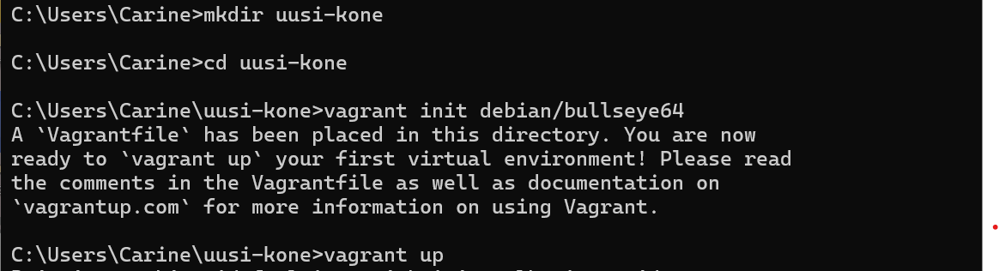
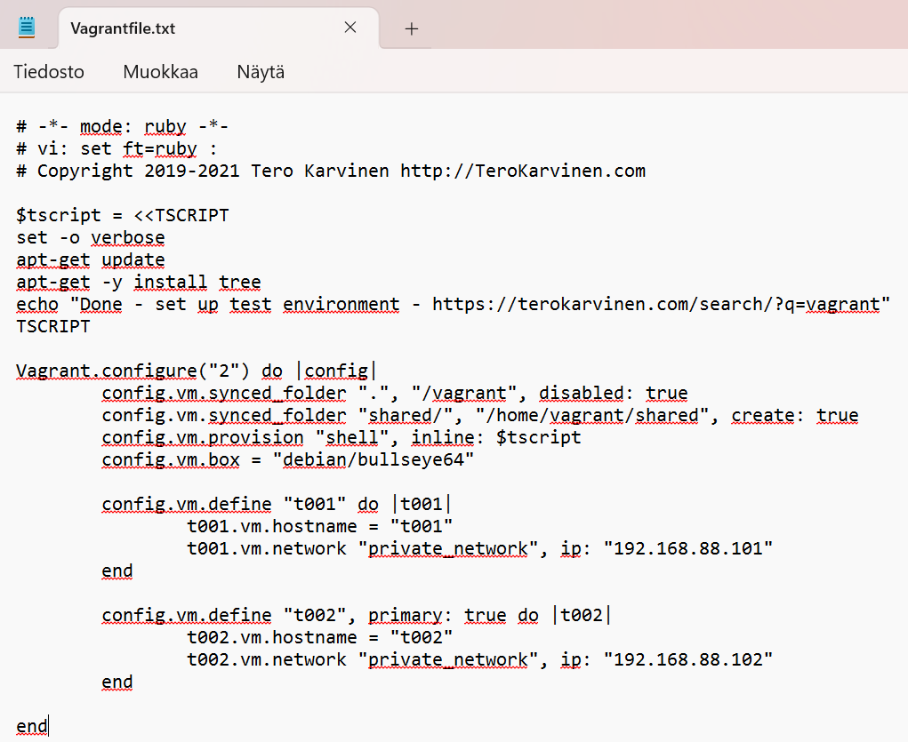
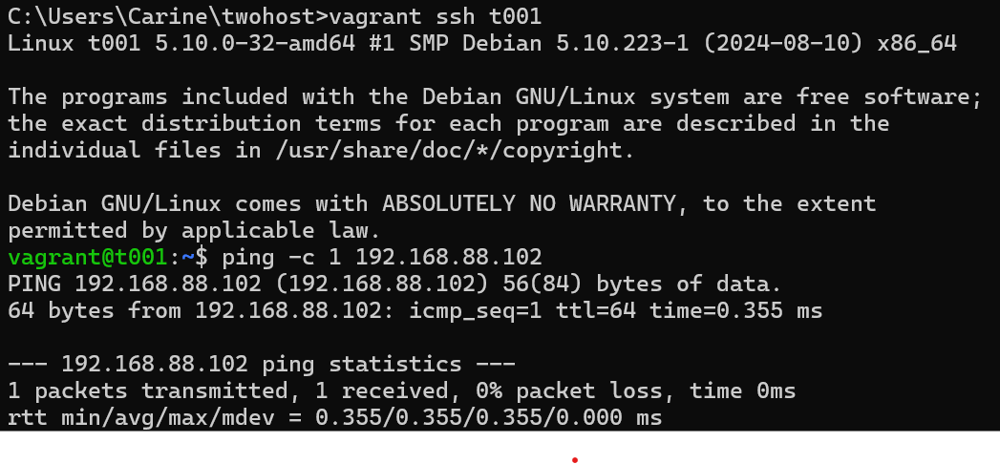
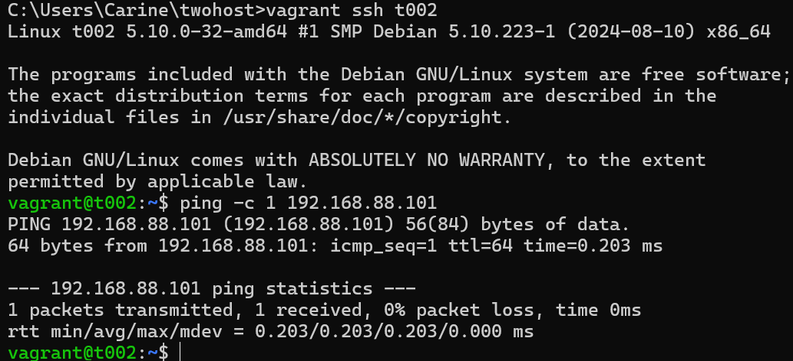

# h2 Soitto kotiin

Viikon 2 tehtävät:

## x) Lue ja tiivistä.

## Two Machine Virtual Network With Debian 11 Bullseye and Vagrant

- Vagrantin avulla kahden koneen virtuaaliverkko pystyyn nopeasti
- Asenna Vagrant
- Luo uusi hakemisto projektille ja tallenna Vagrantfile sinne
- SSH-yhteys virtuaalikoneisiin
- Molemmat koneet voivat kommunikoida keskenään ja käyttää Internetiä
- Virtuaalikoneet voi tuhota nopeasti
- Hyvä tapa harjoitella: tee, testaa, tuhoa ja aloita alusta
- Jos kaikki toimii, olet valmis. Jos ei, jatka vianmääritykseen

## Salt Quickstart – Salt Stack Master and Slave on Ubuntu Linux

- Saltilla voi kontrolloida lukuisia koneita
- Slavet voivat sijaita missä vain ja silti niitä voi kontrolloida
- Vain masterin on oltava julkinen osoite
- Verkossa voi olla yksi master ja useita slaveja
- Asenna master. Jos masterilla on palomuuri, on porttien 4505/TCP ja 4506/TCP oltava auki
- Asenna slave. Slaven pitää tietää missä master sijaitsee
- Käynnistä uudelleen slave daemon saadaksesi uudet asetukset käyttöön ja yhdistääksesi slave masteriin
- Hyväksy slave key masterilla
- Testaa, jos sait vastaksen slavelta, olet onnistunut tehtävässä
- Nyt voit kokeilla muita komentoja slaveillesi

## Salt Vagrant - automatically provision one master and two slaves

-

## a) Hello Vagrant! Osoita jollain komennolla, että Vagrant on asennettu (esim tulostaa vagrantin versionumeron). Jos et ole vielä asentanut niitä, raportoi myös Vagrant ja VirtualBox asennukset. (Jos Vagrant ja VirtualBox on jo asennettu, niiden asennusta ei tarvitse tehdä eikä raportoida uudelleen.)

Aloitin tehtävän asentamalla Vagrantin. Vagrantin avulla luodaan ja hallitaan virtuaalikoneita. 

Käytössäni Windows, joten latasin ensin asennustiedoston. Suoritin asennuksen ja sen jälkeen halusin vielä testata, onko Vagrant varmasti asentunut. Avasin Command Promptin ja syötin komennon

    $ vagrant --version    #Tulostaa Vagrantin versionumeron

Sain onnistuneen vastauksen.

Virtualbox minulla jo oli asennettuna, joten sitä en tässä raportoi.

## b) Linux Vagrant. Tee Vagrantilla uusi Linux-virtuaalikone.

Tarkoituksenani oli luoda uusi virtuaalikone Vagrantilla. Aloitin tehtävän luomalla uuden hakemiston koneelle

    mkdir uusi-kone   #Loin uusi-kone -hakemiston
    cd uusi-kone   #Siirryin uusi-kone -hakemistoon

Seuraavaksi loin Vagrantfilen. Vagrantfile on tiedosto, joka sisältää tietoa siitä millaisia koneita projektissa tarvitaan, miten ne määritellään ja käynnistetään. 

    vagrant init debian/bullseye64   #Loin Vagrantfilen 

## c) Kaksin kaunihimpi. Tee kahden Linux-tietokoneen verkko Vagrantilla. Osoita, että koneet voivat pingata toisiaan.

Seuraavaksi tarkoituksenani oli luoda kaksi virtuaalikonetta. Aloitin taas luomalla uuden hakemiston ja Vagrantfilen.

    mkdir twohost   #Loin twohost -hakemiston
    cd twohost   #Siirryin twohost -hakemistoon
    notepad Vagrantfile   #Loin Vagrantfilen Notepadilla

Vagrantfilen sisälle lisäsin tekstin, jossa määriteltiin kaksi virtuaalikonetta, t001 ja t002 ja mm. niille IP-osoitteet. Tiedosto tallennettiin luomani twohost-hakemiston sisälle.

Vagrantfilen luonnin jälkeen annoin komennon:

    vagrant up   #Luo, konfiguroi ja käynnistää virtuaalikoneet Vagrantfile-tiedoston mukaisesti.

Sain kuitenkin virheilmoituksen, että olen komentorivillä väärässä hakemistossa, koska pitäisi olla juuri siellä, missä Vagrant sijaitsee. Olin mielestäni ihan oikeassa hakemistossa, eli hakemistossa twohost ja tarkistin sen vielä komennolla `dir`. Sielä Vagrantfile tosiaan sijaitsi, eli olin ihan oikeassa paikassa. Asiaa selvitellessäni törmäsin tietoon, että Vagrantfilen nimi pitää olla pelkästään Vagrantfile, .txt ei saa olla perässä tai se ei toimi. Muokkasin tiedostoni nimeä ja poistin lopusta .txt ja kokeilin uudelleen `vagrant up` komentoa. Nyt se vihdoin toimi!

Molemmat uudet koneet käynnistyivät ja ilmestyivät Virtualboxiin.

Koneiden käynnistymisen jälkeen kirjauduin ensimmäiseen virtuaalikoneeseen t001 komennolla:

    vagrant ssh t001   #Avasin SSH-yhteyden t001-koneeseen komentoriviltä

SSH-yhteyden muodostamisen jälkeen testasin, että koneet pysytvät kommunikoimaan keskenään. Annoin t001-koneessa komennon:

    ping -c 1 192.168.88.102   #Pingasin t002-konetta yhden kerran

Vastauksena sain pingauksen onnistuneen, koneet voivat siis kommunikoida keskenään.

Poistuin t001-koneesta komennolla:

    exit   #Katkaisin SSH-yhteyden t001-koneeseen

Palasin takaisin isäntäkoneelleni Windowsille. Kirjauduin seuraavaksi t002-koneelle:

    vagrant ssh t002   #Avasin SSH-yhteyden t002-koneeseen komentoriviltä 

Annoin t002-koneesta komennon:

    ping -c 1 192.168.88.101   #Pingasin t001-konetta yhden kerran

Vastauksena sain pingauksen onnistuneen.

## d) Herra-orja verkossa. Demonstroi Salt herra-orja arkkitehtuurin toimintaa kahden Linux-koneen verkossa, jonka teit Vagrantilla. Asenna toiselle koneelle salt-master, toiselle salt-minion. Laita orjan /etc/salt/minion -tiedostoon masterin osoite. Hyväksy avain ja osoita, että herra voi komentaa orjakonetta.

## e) Kokeile vähintään kahta tilaa verkon yli (viisikosta: pkg, file, service, user, cmd)

Lähteet:

Karvinen, T. 2025. Läksyt: h2 Soitto kotiin. Luettavissa: https://terokarvinen.com/palvelinten-hallinta/ Luettu: 3.4.2025

Karvinen, T. 2021. Two Machine Virtual Network With Debian 11 Bullseye and Vagrant. Luettavissa: https://terokarvinen.com/2021/two-machine-virtual-network-with-debian-11-bullseye-and-vagrant/ Luettu: 3.4.2025

Karvinen, T. 2018. Salt Quickstart – Salt Stack Master and Slave on Ubuntu Linux. Luettavissa: https://terokarvinen.com/2018/salt-quickstart-salt-stack-master-and-slave-on-ubuntu-linux/?fromSearch=salt%20quickstart%20salt%20stack%20master%20and%20slave%20on%20ubuntu%20linux Luettu: 3.4.2025

Karvinen, T. 2023. Salt Vagrant - automatically provision one master and two slaves. Luettavissa: https://terokarvinen.com/2023/salt-vagrant/#infra-as-code---your-wishes-as-a-text-file Luettu: 3.4.2025

HashiCorp. Install Vagrant. Luettavissa: https://developer.hashicorp.com/vagrant/install Luettu: 4.4.2025

HashiCorp. Vagrantfile. Luettavissa: https://developer.hashicorp.com/vagrant/docs/vagrantfile Luettu: 4.4.2025

Skytap. Creating a Vagrantfile. Luettavissa: https://help.skytap.com/vagrant-creating-a-vagrantfile.html#ManuallycreateaVagrantfile Luettu: 4.4.2025

Karvinen, T. Vagrant LibVirt - New virtual machine in 20 seconds. Luettavissa: https://terokarvinen.com/2024/vagrant-libvirt/ Luettu: 4.4.2025

