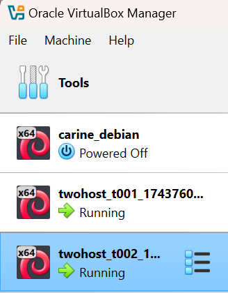

# h2 Soitto kotiin

Viikon 2 tehtävät:

## x) Lue ja tiivistä.

## Two Machine Virtual Network With Debian 11 Bullseye and Vagrant

- Vagrantin avulla kahden koneen virtuaaliverkko pystyyn nopeasti
- Asenna Vagrant
- Luo uusi hakemisto projektille ja tallenna Vagrantfile sinne
- SSH-yhteys virtuaalikoneisiin
- Molemmat koneet voivat kommunikoida keskenään ja käyttää Internetiä
- Virtuaalikoneet voi tuhota nopeasti
- Hyvä tapa harjoitella: tee, testaa, tuhoa ja aloita alusta
- Jos kaikki toimii, olet valmis. Jos ei, jatka vianmääritykseen

## Salt Quickstart – Salt Stack Master and Slave on Ubuntu Linux

- Saltilla voi kontrolloida lukuisia koneita
- Slavet voivat sijaita missä vain ja silti niitä voi kontrolloida
- Vain masterin on oltava julkinen osoite
- Verkossa voi olla yksi master ja useita slaveja
- Asenna master. Jos masterilla on palomuuri, on porttien 4505/TCP ja 4506/TCP oltava auki
- Asenna slave. Slaven pitää tietää missä master sijaitsee
- Käynnistä uudelleen slave daemon saadaksesi uudet asetukset käyttöön ja yhdistääksesi slave masteriin
- Hyväksy slave key masterilla
- Testaa. Jos sait vastauksen slavelta, olet onnistunut tehtävässä
- Nyt voit kokeilla muita komentoja slaveillesi

## Salt Vagrant - automatically provision one master and two slaves

- Artikkeli kertoo, miten Saltilla voi hallita virtuaaikoneita Vagrantin avulla käyttämällä tilatiedostoja (states) 
- Infra as code: 
    - Salt tila määritellään init.sls -tiedostoon, jossa kuvataan haluttu lopputila, esim. olemassa oleva tiedosto
    - Tiedosto kirjoitetaan YAML-muodossa. Sisennys kaksi välilyöntiä
    - Komennolla `state.apply` master ohjaa minioneja toteuttamaan määritellyn tilan
- top.sls:
    - top.sls -tiedosto määrittää, mitä tiloja ajetaan millä minioneilla
    - kun top.sls määritelty, tiloja voidaan ajaa ilman nimiä yksinkertaisesti komennolla `sudo salt '*' state.apply`
      
## a) Hello Vagrant! Osoita jollain komennolla, että Vagrant on asennettu (esim tulostaa vagrantin versionumeron). Jos et ole vielä asentanut niitä, raportoi myös Vagrant ja VirtualBox asennukset. (Jos Vagrant ja VirtualBox on jo asennettu, niiden asennusta ei tarvitse tehdä eikä raportoida uudelleen.)

Aloitin tehtävän asentamalla Vagrantin. Vagrantin avulla luodaan ja hallitaan virtuaalikoneita. 

Käytössäni Windows, joten latasin ensin asennustiedoston. Suoritin asennuksen ja sen jälkeen halusin vielä testata, onko Vagrant varmasti asentunut. Avasin Command Promptin ja annoin komennon

    $ vagrant --version    #Tulostin Vagrantin versionumeron

Sain onnistuneen vastauksen.

Virtualbox minulla jo oli asennettuna, joten sitä en tässä raportoi.

## b) Linux Vagrant. Tee Vagrantilla uusi Linux-virtuaalikone.

Tarkoituksenani oli luoda yksi uusi virtuaalikone Vagrantilla. Aloitin tehtävän luomalla uuden hakemiston tätä konetta varten:

    mkdir uusi-kone   #Loin uusi-kone -hakemiston
    cd uusi-kone   #Siirryin uusi-kone -hakemistoon

Seuraavaksi loin Vagrantfilen. Vagrantfile on tekstitiedosto, joka sisältää tietoa virtuaalikoneen asetuksista: mitä käyttöjärjestelmää käytetään, miten kone käynnistetään yms. Annoin komennon

    vagrant init debian/bullseye64   #Loin Vagrantfilen, jossa määritellään, että virtuaalikone käyttää Debian Bullseye (64 bittinen) -käyttöjärjestelmää

Tämän jälkeen käynnistin koneen:

    vagrant up   #Luo, konfiguroi ja käynnistää virtuaalikoneen Vagrantfile-tiedoston mukaisesti

vagrant up -komento on Vagrantin tärkein komento. Se luo virtuaalikoneen ja käynnistää sen. Jos kone on jo valmiina, komento vain käynnistää sen uudelleen.

Uusi kone ilmestyi myös Virtualboxiin näkyviin.

## c) Kaksin kaunihimpi. Tee kahden Linux-tietokoneen verkko Vagrantilla. Osoita, että koneet voivat pingata toisiaan.

Seuraavaksi tarkoituksenani oli luoda kaksi virtuaalikonetta. Aloitin taas luomalla uuden hakemiston ja Vagrantfilen:

    mkdir twohost   #Loin twohost -hakemiston
    cd twohost   #Siirryin twohost -hakemistoon
    notepad Vagrantfile   #Loin Vagrantfilen Notepadilla

Vagrantfilen sisälle lisäsin koodin, jossa määriteltiin kaksi virtuaalikonetta, t001 ja t002 sekä niille mm. IP-osoitteet. Tiedosto tallennettiin luomani twohost-hakemistoon.

Vagrantfilen luonnin jälkeen annoin komennon:

    vagrant up   #Luo, konfiguroi ja käynnistää virtuaalikoneet Vagrantfile-tiedoston mukaisesti

Sain kuitenkin virheilmoituksen, että olin väärässä hakemistossa. Vagrantin komennot pitää suorittaa juuri siinä hakemistossa, missä Vagrantfile sijaitsee. Tarkistin sijaintini komennolla `dir`. Sielä Vagrantfile tosiaan sijaitsi, eli olin ihan oikeassa paikassa. Asiaa selvitellessäni minulle selvisi, että Vagrantfilen nimi pitää olla pelkästään Vagrantfile, .txt ei saa olla perässä tai Vagrant ei tunnista sitä. Muokkasin tiedoston nimeä ja poistin lopusta .txt ja kokeilin `vagrant up` komentoa uudelleen. Tämän jälkeen komento toimi.

Molemmat uudet koneet käynnistyivät ja ilmestyivät Virtualboxiin.

Koneiden käynnistymisen jälkeen kirjauduin ensimmäiseen virtuaalikoneeseen t001:

    vagrant ssh t001   #Avasin SSH-yhteyden t001-koneeseen

Yhteyden muodostamisen jälkeen testasin, että koneet pysytvät kommunikoimaan keskenään. Annoin t001-koneessa komennon:

    ping -c 1 192.168.88.102   #Pingasin t002-konetta yhden kerran

Vastauksena sain pingauksen onnistuneen, koneet voivat siis kommunikoida keskenään.

Poistuin t001-koneesta komennolla:

    exit   #Katkaisin SSH-yhteyden t001-koneeseen

Palasin isäntäkoneelleni. Kirjauduin seuraavaksi t002-koneelle:

    vagrant ssh t002   #Avasin SSH-yhteyden t002-koneeseen

Annoin t002-koneesta komennon:

    ping -c 1 192.168.88.101   #Pingasin t001-konetta yhden kerran

Vastauksena sain pingauksen onnistuneen.

## d) Herra-orja verkossa. Demonstroi Salt herra-orja arkkitehtuurin toimintaa kahden Linux-koneen verkossa, jonka teit Vagrantilla. Asenna toiselle koneelle salt-master, toiselle salt-minion. Laita orjan /etc/salt/minion -tiedostoon masterin osoite. Hyväksy avain ja osoita, että herra voi komentaa orjakonetta.

Tässä tehtävässä tarkoituksena oli demonstroida Saltin herra-orja-arkkitehtuuria kahden virtuaalikoneen verkossa. 

Aloitin tehtävän Salt-masterin asennuksesta. Päätin, että t001-kone on master-kone.

    vagrant ssh t001    #Avasin SSH-yhteyden t001-koneeseen

Asensin Saltin repositoryn:

    sudo mkdir -p /etc/apt/keyrings    #Varmistin, että keyrings-kansio on olemassa
    sudo apt-get update    #Hain uusimmat tiedot ohjelmapaketeista
    sudo apt-get install curl    #Asensin curlin
    curl -fsSL https://packages.broadcom.com/artifactory/api/security/keypair/SaltProjectKey/public | sudo tee /etc/apt/keyrings/salt-archive-keyring.pgp   #Loin uuden luottamussuhteen
    curl -fsSL https://packages.broadcom.com/artifactory/api/security/keypair/SaltProjectKey/public | sudo tee /etc/apt/keyrings/salt-archive-keyring.pgp   #Loin apt repo määritystiedoston

Tämän jälkeen oli Salt-masterin asennuksen vuoro:

    sudo apt-get update    #Hain uusimmat tiedot ohjelmapaketeista
    sudo apt-get -y install salt-master    #Asensin Salt-masterin

Tarkistin vielä koneen IP-osoitteen:

    hostname -I   #Katsoin koneen IP-osoitteet

IP-osoite oli oikea ja sama, mikä Vagrantfilessä oli määritelty. 

Seuraavaksi siirryin t002-koneelle Salt-minionin asennukseen.

    vagrant ssh t002   #Avasin SSH-yhteyden t002-koneeseen

Tein saman Saltin repon asennuksen kuin masterille ja sen jälkeen asensin Salt-minionin:

    sudo apt-get update   #Hain uusimmat tiedot ohjelmapaketeista
    sudo apt-get -y install salt-minion   #Asensin Salt-minionin

Asennuksen jälkeen 

    sudoedit /etc/salt/minion   #Muokkasin minionin asennustiedostoa

Lisäsin seuravaat tiedot:

master: 192.168.88.101 (masterin IP-osoite)

id: t002 (minionin id)

Tallennuksen jälkeen käynnistin minion-palvelun uudelleen:

    sudo systemctl restart salt.minion.service   #Käynnistin minion-palvelun uudelleen
    sudo systemctl status salt.minion.service    #Varmistin, että palvelu on varmasti päällä

Tämän jälkeen poistuin minionilta ja siirryin takaisin masterille. Tarkoituksena oli hyväksyä minionin avain masterilla, jotta yhteys voitiin muodostaa näiden välille. Annoin komennon:

    sudo salt-key -A   #Siirryin hyväksymään minionin avaimen masterilla

Vastauksena piti saada ilmoitus hyväksymättömästä avaimesta ja hyväksyä se, mutta odotettua avainta ei ilmestynyt listaan. En tiennyt mistä ongelma johtui, joten varmistin, että master- ja minion-palvelut ovat käynnissä ja yhteys niiden välillä toimi. Palvelut olivat päällä ja koneet pystyivät pingaamaan toisiaan kuten aikaisemminkin. Yritin monta kertaa käynnistää palvelut uudelleen ja tarkistaa asetukset, mutta mitään ei tapahtunut eikä avain ilmestynyt. Lopulta en keksinyt muuta kuin aloittaa koko asennus puhtaalta pöydältä, koska en yhtään tiennyt missä ongelma voisi olla. Ehkä välistä oli jäänyt joku asennus tai päivitys?

Annoin komennon:

    vagrant destroy   #Poistin t001 ja t002 koneet

Annoin uudelleen `vagrant up` -komennon, jolla luotiin ja käynnistetttiin uudelleen Vagrantfilen määrittelyn mukaisesti. Tein samat vaiheet, mitkä on jo yllä kuvattu, eli t001:lle Salt-masterin asennuksen, t002:lle Salt-minionin asennuksen ja asetusten muokkauksen /etc/salt/minion- tiedostooon. Käynnistin palvelut uudelleen ja toivoin, että minionin avain ilmestyisi vihdoin näkyviin. Ja se ilmestyi! Hyväksyin avaimen.

Halusin vielä osoittaa, että master voi komentaa minionia. Annoin komennon:

    sudo salt '*' cmd.run 'whoami'   #Master lähettää kaikille minioneille komennon 'whoami', joka palauttaa käyttäjänimen

Vastaus osoittaa, että master voi komentaa minionia.

## e) Kokeile vähintään kahta tilaa verkon yli (viisikosta: pkg, file, service, user, cmd)

Lähteet:

Karvinen, T. 2025. Läksyt: h2 Soitto kotiin. Luettavissa: https://terokarvinen.com/palvelinten-hallinta/ Luettu: 3.4.2025

Karvinen, T. 2021. Two Machine Virtual Network With Debian 11 Bullseye and Vagrant. Luettavissa: https://terokarvinen.com/2021/two-machine-virtual-network-with-debian-11-bullseye-and-vagrant/ Luettu: 3.4.2025

Karvinen, T. 2018. Salt Quickstart – Salt Stack Master and Slave on Ubuntu Linux. Luettavissa: https://terokarvinen.com/2018/salt-quickstart-salt-stack-master-and-slave-on-ubuntu-linux/?fromSearch=salt%20quickstart%20salt%20stack%20master%20and%20slave%20on%20ubuntu%20linux Luettu: 3.4.2025

Karvinen, T. 2023. Salt Vagrant - automatically provision one master and two slaves. Luettavissa: https://terokarvinen.com/2023/salt-vagrant/#infra-as-code---your-wishes-as-a-text-file Luettu: 3.4.2025

HashiCorp. Install Vagrant. Luettavissa: https://developer.hashicorp.com/vagrant/install Luettu: 4.4.2025

HashiCorp. Vagrantfile. Luettavissa: https://developer.hashicorp.com/vagrant/docs/vagrantfile Luettu: 4.4.2025

Skytap. Creating a Vagrantfile. Luettavissa: https://help.skytap.com/vagrant-creating-a-vagrantfile.html#ManuallycreateaVagrantfile Luettu: 4.4.2025

Karvinen, T. Vagrant LibVirt - New virtual machine in 20 seconds. Luettavissa: https://terokarvinen.com/2024/vagrant-libvirt/ Luettu: 4.4.2025

HashiCorp. Up. Luettavissa: https://developer.hashicorp.com/vagrant/docs/cli/up Luettu: 4.4.2025

