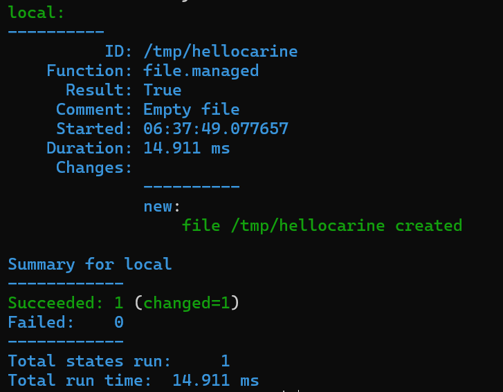
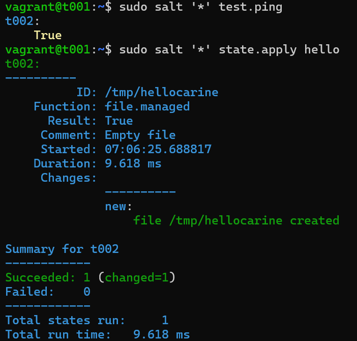
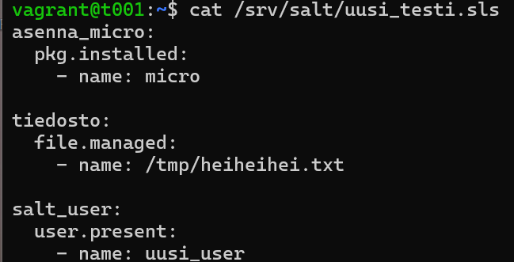
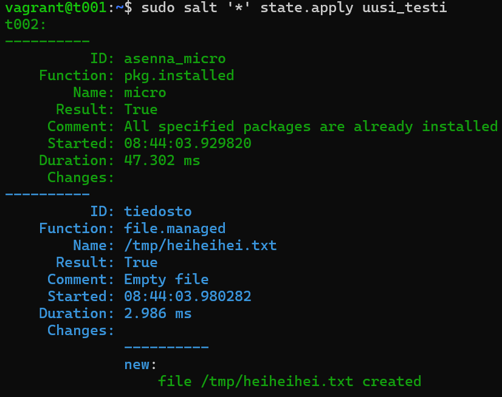
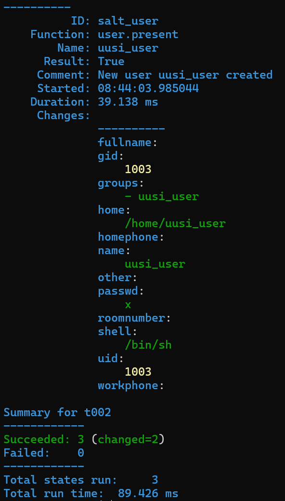
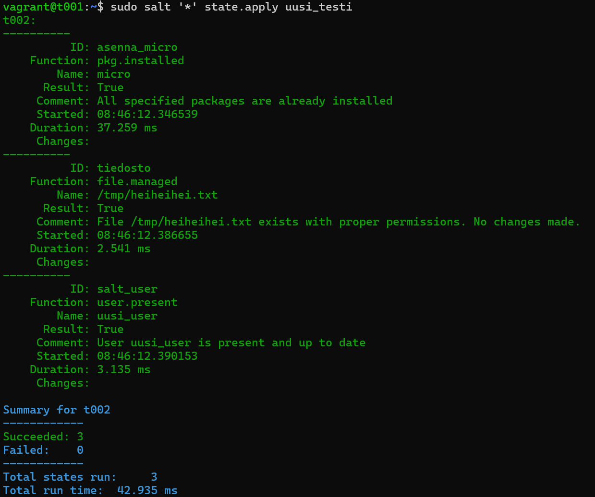
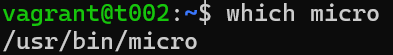
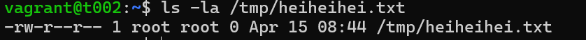
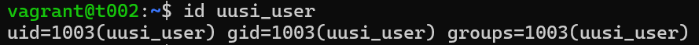

# h3 Infraa koodina

Viikon 3 tehtävät:

## x) Lue ja tiivistä.

## Tero Karvinen: Hello Salt Infra-as-code
- Artikkelissa kuvataan, miten luodaan Salt-konfiguraatio, jolla varmistetaan, että tietty tekstitiedosto on olemassa
- Asenna Salt
- Luo kansio "hello" moduulillle. Moduulit asentavat, konfiguroivat ja käynnistävät asioita. Luotu kansio jaetaan myöhemmin kaikille minion-koneille
- Kirjoita infraa koodina
- Aja koodi. Saat selosteen siitä, mitä tapahtui
- Tarkista, että tiedosto on olemassa
- Kun koodin ajaa ensimmäisen kerran, se luo tiedoston. Seuraavilla kerroilla Salt tarkistaa, onko tiedosto jo olemassa. Koska se on jo luotu, se ei tee mitään = idempotenssi
- Tärkeimmät tilat ovat pkg, file, service, user ja cmd

## Salt overview
- Salt käyttää oletuksena YAML-renderöintiä tiedostoissa. Renderöinti tarkoittaa
- YAML:n perussäännöt:
  - data esitetään key: value -pareina
  - Kaksoispiste ja yksi välilyönti (": ")
  - Avainten arvot voi olla eri muodoissa
  - Kaikki avaimet ovat case-sensitive, eli kirjainkoolla on merkitystä
  - Ei tabulaattorin käyttöä, vain välilyöntejä
  - Kommentit alkavat risuaidalla (#)
- YAML koostuu kolmesta peruselementistä:
  - Scalaarit (Scalars)
  - Listat (Lists)
  - Sanakirjat (Dictionary)
- YAML perustuu lohkorakenteisiin, jotka määräytyvät sisennysten perusteella
- Ominaisuudet ja listat täytyy sisentää vähintään yhdellä välilyönnillä, yleensä käytetään kahta
- Kokoelma, mikä on lista tai sanakirjojen alkio alkaa väliviivalla ja välilyönnillä ("- ")

## a) Hei infrakoodi! Kokeile paikallisesti (esim 'sudo salt-call --local') infraa koodina. Kirjota sls-tiedosto, joka tekee esimerkkitiedoston /tmp/ -kansioon.

Tarkoituksenani oli kokeilla infrasktruktuurin hallintaa Saltin avulla. Tehtävänä oli luoda SLS-tiedosto, joka luo esimerkkitiedoston /tmp/ -hakemistoon ja ajaa sen paikallisesti.

Avattuani koneeni loin uuden hakemiston ja SLS-tiedoston sen sisälle:

    $ sudo mkdir -p /srv/salt/hello/   #Loin uuden hakemiston
    $ cd /srv/salt/hello/   #Siirryin uuteen hakemistoon
    $ sudoedit init.sls   #Muokkasin SLS-tiedoston sisältöä

Tiedoston sisälle kirjoitin:

    /tmp/hellocarine:
      file.managed

Tällä määrittelin, että tiedosto /tmp/hellocarine tulee olla olemassa. Mikäli tiedostoa ei vielä ole olemassa, Salt luo tyhjän tiedoston.

Tallensin tiedoston ja ajoin komennon paikallisesti:

    $ sudo salt-call --local state.apply hello    #

Vastaukseksi sain tilan onnistuneen.

Result: True = tila suoritettiin onnistuneesti

Changes: new = uusi tiedosto /tmp/hellocarine luotiin
    

## b) Aja esimerkki sls-tiedostosi verkon yli orjalla.

Seuraavaksi tarkoitus oli suorittaa edellisessä tehtävässä luotu SLS-tiedosto verkon yli minonilla. Testasin ensin yhteyttä masterin ja minionin välillä:

    $ sudo salt '*' test.ping    #Testasin yhteyttä masterin ja minionin välillä

Vastaus oli True, mikä vahvisti yhteyden masterin ja minionin välillä. Pääsin ajamaan komennon:

    $ sudo salt '*' state.apply hello   #Käskin masteria ajamaan hello-tilan kaikilla minioneilla, eli toteuttamaan siihen määritellyn tehtävän

Vastaukseksi sain tilan onnistuneen. Tiedosto luotiin minion-koneelle.

Result: True = tila suoritettiin onnistuneesti

Changes: new = uusi tiedosto /tmp/hellocarine luotiin minon-koneelle

Summary for t002 = komento kohdistui minioniin t002

## c) Tee sls-tiedosto, joka käyttää vähintään kahta eri tilafunktiota näistä: package, file, service, user. Tarkista eri ohjelmalla, että lopputulos on oikea. Osoita useammalla ajolla, että sls-tiedostosi on idempotentti.

Viimeiseksi tehtävänäni oli luoda uusi SLS-tiedosto, joka käyttää vähintään kahta eri Saltin tilafunktiota. Valitsin käyttää funktioita package, file ja user. 

Loin uuden SLS-tiedoston /srv/salt/ -hakemistoon:

    $ sudoedit /srv/salt/uusi_testi.sls   #Muokkasin uusi_testi -SLS-tiedoston sisältöä

Sen sisälle kirjotin:

    asenna_micro:
      pkg.installed:
        - name: micro

    tiedosto:
      file.managed:
        - name: /tmp/heiheihei.txt

    salt_user:
      user.present:
        - name: uusi_user

  

Tässä SLS-tiedostossa määrittelin, että Saltin tulee asentaa micro-editori, luoda tyhjä tiedosto /tmp/hei.txt sekä lisätä käyttäjä salt_user, mikäli näitä ei jo ole olemassa. 

Ajoin komennon: 

    $ sudo salt '*' state.apply uusi_testi   # Käskin masteria ajamaan uusi_testi -tilan kaikilla minioneilla, eli toteuttamaan siihen määritellyt tehtävät

Vastaukseksi sain, että micro-editori on jo asennettu. Tiedostoa heiheihei.txt ei ollut, joten se luotiin, samoin uusi käyttäjä uusi_user.

Lopputulos piti vielä tarkistaa erillisillä komennoilla ja osoittaa, että SLS-tiedosto on idempotentti. 

Ajoin komennon `sudo salt '*' state.apply uusi_testi` vielä muutaman kerran uudelleen ja vastaukseksi sain, että ne on jo olemassa, eli mitään ei muutettu.

Siirryin vielä minionin puolelle tarkistamaan, että tila oli oikeasti toteutunut oikein.

Varmistin Micro-editorin asennuksen varmistin komennolla:

    $ which micro 

Se palautti vastauksena polun, missä micro sijaitsee, eli asennus oli onnistunut.

Tiedoston /tmp/heiheihei.txt olemassaolon tarkistin komennolla:

    $ ls -la /tmp/heiheihei.txt

Tiedosto löytyi, joten se oli onnistuneesti luotu.

Käyttäjän uusi_user olemassaolon tarkistin komennolla:

    $ id uusi_user

Vastaukseksi sain, että käyttäjä löytyi, eli se oli lisätty onnistuneesti.

Lähteet:

Karvinen, T. 2025. Läksyt: h3 Infraa koodina. Luettavissa: https://terokarvinen.com/palvelinten-hallinta/#laksyt Luettu: 15.4.2025

Karvinen, T. 2024. Luettavissa: https://terokarvinen.com/2024/hello-salt-infra-as-code/ Luettu: 15.4.2025

VMware Inc. Salt overview. Luettavissa: https://docs.saltproject.io/salt/user-guide/en/latest/topics/overview.html#rules-of-yaml Luettu: 15.4.2025

VMWare Inc. 2025. How Do I Use Salt States? Luettavissa: https://docs.saltproject.io/en/3006/topics/tutorials/starting_states.html Luettu: 15.4.2025

