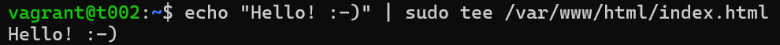

# h4 Pkg-file-service

Viikon 4 tehtävät:

## x) Lue ja tiivistä

## Tero Karvinen: Pkg-File-Service – Control Daemons with Salt – Change SSH Server Port
- Suuria määriä daemoneja on mahdollista hallita Saltilla konfiguraationhallintajärjestelmän avulla
- Package-file-service on yleinen tapa: pkg.installed asentaa ohjelman, file.managed hallitsee asetustiedostoa ja service.running käynnistää palvelun uudelleen, jotta uudet asetukset saa käyttöön. Jos asetustiedosto muuttuu, palvelu käynnistyy uudelleen watch-määrityksen avulla
- Masterin asetustiedostoon määritellään esimerkiksi uusi SSH-portti, esim. Port 8888
- Aja komento masterilla: sudo salt '*' state.apply sshd
- Testaa muutokset minionilla. Tarkista että portti toimii: nc -vz localhost [portti]
- Yhdistä SSH:lla uuteen porttiin: ssh -p [portti] [käyttäjä]@localhost. Jos saat kirjautumispyynnön, olet onnistunut

## a) Apache easy mode. Asenna Apache, korvaa sen testisivu ja varmista, että demoni käynnistyy. Ensin käsin, vasta sitten automaattisesti. Kirjoita tila sls-tiedostoon. pkg-file-service. Tässä ei tarvita service:ssä watch, koska index.html ei ole asetustiedosto.

Tehtävän tarkoitus oli asentaa ja konfiguroida Apache ensin käsin ja sitten automatisoida se Saltilla käyttäen pkg-file-service -rakennetta. Tarkoituksena oli myös korvata oletussivu omalla.

Aloitin tehtävän tekemällä kaiken käsin minionilla ja annoin komennot:

    $ sudo apt-get update    #Päivitin pakettien listan
    $ sudo apt-get install apache2 -y   #Asensin Apachen

Asennuksen jälkeen testasin selaimella, että palvelu toimii avaamalla osoitteen http://192.168.88.102, eli minionin IP-osoitteen. Sain näkyviin Apachen oletussivun, eli se toimi.

Tämän jälkeen korvasin Apachen oletussivun omalla versiollani. Annoin komennon:

    $ echo “Hello”! :-) | sudo tee /var/www/html/index.html   #Muutin oletussivun

Testasin, että uusi konfiguroimani sivu varmasti toimii. Katsoin taas selaimelta osoitteen http://192.168.88.102 ja sielä näkyi teksti, jonka olin määritellyt.

Onnistuin siis tekemään sen käsin ja seuraavaksi se piti automatisoida. Poistin minionilta käsin tehdyt muutokset:

    $ sudo rm /var/www/html/index.html    #Poistin luomani oletussivun
    $ sudo apt remove apache2 -y   #Poistin Apachen asennuksen

Testasin taas uudelleen selaimessa minionin IP-osoitteen ja vastaukseksi sain, että muokkaamani sivu ei ollut enää saatavilla.

Siirryin tämän jälkeen masterille automatisoinnin kimppuun. Kuten minionilla, loin oman oletussivun:

    $ echo “Hello”! :-) | sudo tee /var/www/html/index.html   #Loin oletussivun Salt-masterille

Tämän jälkeen loin SLS-tiedoston, joka asensi nApachen, hallitsi index.html -tiedostoa ja varmisti, että palvelu on käynnissä:

Tallensin tiedoston ja ajoin komennon:

    $ sudo salt '*' state.apply apache   #Ajoin Salt-tilan kaikilla minioneilla

Vastauksena sain onnistumisia jokaisesta vaiheesta: 

Testasin vielä minionilla, että palvelu varmasti toimii ja on käynnissä. Siirryin taas minionille ja testasin selaimessa.

Onnistuin siis asentamaan ja konfiguroimaan Apache-palvelimen käsin, sekä automatisoimaan saman prosessin Saltilla pkg-file-service -rakenteen avulla. 

## b) SSHouto. Lisää uusi portti, jossa SSHd kuuntelee. Jos käytät Vagrantia, muista jättää portti 22/tcp auki - se on oma yhteytesi koneeseen. SSHd:n asetustiedostoon voi tehdä yksinkertaisesti kaksi "Port" riviä, molemmat portit avataan. Löydät oikean asetuksen katsomalla SSH:n asetustiedostoa. Nyt tarvitaan service-watch, jotta demoni käynnistetään uudelleen, jos asetustiedosto muuttuu masterilla

Tehtävän tarkoitus oli lisätä SSH-palvelimelle toinen portti, jolla SSH kuuntelee, ensin käsin ja sitten automatisoida Saltilla. Lisäksi piti käyttää watch-määritystä, jotta SSH-palvelu käynnistyy automaattisesti uudelleen, jos asetustiedosto muuttuu.

Aloitin käsin testaamisen minionilta. Muokkasin SSH:n asetustiedostoa /etc/ssh/sshd_config ja lisäsin sinne tiedon uudesta portista:

    Port 22
    Port 1234

Tallensin tiedoston. Käynnistin SSH:n uudelleen ja tarkistin sen tilan:

    $ sudo systemctl restart ssh   #Käynnistin SSH:n
    $ sudo systemctl status ssh   #Tarkistin SSH:n tilan

SSH oli käynnissä. Testasin portit 22 ja 1234. Molemmat portit olivat auki ja kuuntelevat. 

Seuraavaksi poistin käsin tehdyt muutokset minionilta. Muokkasin asetustiedostoa:

    $ sudo nano /etc/ssh/sshd_config   #Muokkasin asetustiedostoa minionilla

Poistin lisäämäni rivin "Port 1234". Lisäksi muokkasin rivin "Port 22" takaisin kommentiksi, eli lisäsin risuaidan sen eteen. Näin tiedoston ja SSH:n asetukset palautuivat takaisin alkuperäiseen tilaan ennen kuin automatisoin.

Tämän jälkeen siirryin masterille automatisoinnin pariin. Loin SLS-tiedoston 

    $ sudo nano /srv/salt/ssh.sls   #Loin SLS-tiedoston

Sen sisälle määrittelin..

Tallennuksen jälkeen loin asetustiedoston:

    $ sudo nano /srv/salt/sshd_config  #Muokkasin asetustiedostoa

Lisäsin sinne tiedon tarvittavista porteista:

    Port 22
    Port 1234

Tämän jälkeen automatisoin:

    Sudo salt '*' state.apply ssh   #Ajoin Salt-tilan kaikilla minioneilla

Sain vastauksena, että SSH-palvelin oli jo asennettu, eikä tehnyt sille muutoksia. SSH-asetustiedosto /etc/ssh/sshd_config päivitettiin uudella sisällöllä. Tämän jälkeen SSH-palvelu käynnistettiin uudelleen, jotta muutokset saatiin voimaan. Kaikki tehtävät onnistuivat ja kaksi niistä muutti järjestelmän tilaa.

Tämän jälkeen menin vielä minionille testaamaan portit. Annoin komennot:

    nc -vz localhost 22   #
    nc -vz localhost 1234   #

Lähteet:

Karvinen, T. 2025. Läksyt: h4 Pkg-file-service. Luettavissa: https://terokarvinen.com/palvelinten-hallinta/#laksyt Luettu: 16.4.2025

Karvinen, T. 2025. Pkg-File-Service – Control Daemons with Salt – Change SSH Server Port. Luettavissa: https://terokarvinen.com/2018/04/03/pkg-file-service-control-daemons-with-salt-change-ssh-server-port/?fromSearch=karvinen%20salt%20ssh Luettu: 16.4.2025

VMware Inc. 2025. States tutorial, part 1 - Basic Usage. Luettavissa: https://docs.saltproject.io/en/3006/topics/tutorials/states_pt1.html?utm_source=chatgpt.com Luettu: 21.4.2025

